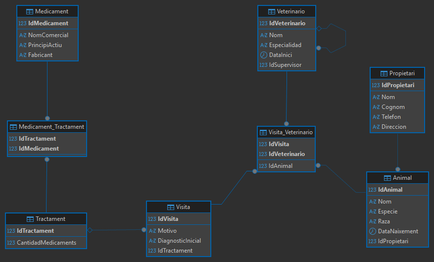

# 🏥 Hospital Veterinari - Base de Datos SQL

Proyecto de diseño y desarrollo de una base de datos relacional para la gestión integral de un hospital veterinario. Este repositorio contiene el esquema lógico, las restricciones de integridad y el diagrama Entidad-Relación generado.

## 📊 Diagrama Entidad-Relación (E-R)

## 🛠️ Características Técnicas
El script SQL implementa los siguientes conceptos avanzados de bases de datos:
* **Relaciones Reflexivas:** Gestión de jerarquías de supervisión.
* **Entidades Asociativas:** Resolución de relaciones N:M entre.
* **Integridad Referencial:** Uso de `FOREIGN KEY` con políticas `ON DELETE CASCADE` para mantener la consistencia.
* **Claves Primarias Compuestas:** Implementadas en tablas intermedias para asegurar la unicidad de los registros.
* **Estandarización:** Uso del motor `InnoDB` y codificación `utf8mb4_spanish_ci`.

## 📂 Archivos
* `HospitalVeterinariScript.sql`: Script completo de MariaDB con la estructura de todas las tablas.
* `HospitalVeterinariE-R`: Diagrama visual del modelo relacional.
